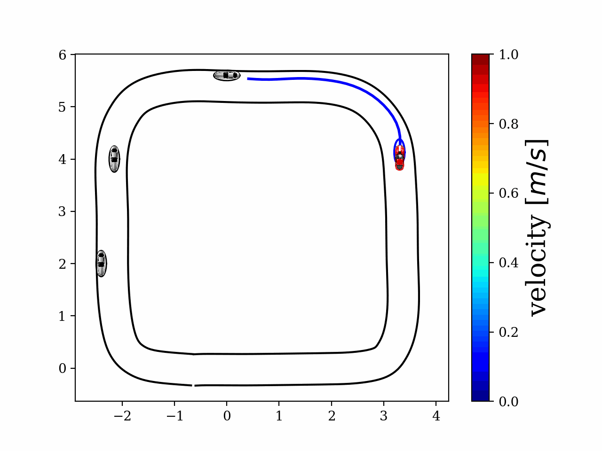

# Safe Autonomous Racing using iLQR and Rollout-based Shielding: A JAX Implementation

[![License][license-shield]][license-url]
[](https://www.python.org/downloads/)
[![Colab Notebook][homepage-shield]][homepage-url]


<!-- PROJECT LOGO -->
<br />
<p align="center">
  <a href="https://github.com/SafeRoboticsLab/iLQR_jax_racing_dev">
    
  </a>
  <!-- <h3 align="center">ILQR JAX Racing</h3> -->
  <p align="center">
    <!-- Safe Autonomous Racing using iLQR and Rollout-based Shielding: A JAX Implementation -->
  </p>
</p>


<!-- TABLE OF CONTENTS -->
<details open="open">
  <summary><h2 style="display: inline-block">Table of Contents</h2></summary>
  <ol>
    <li><a href="#about-the-project">About The Project</a></li>
    <li><a href="#dependencies">Dependencies</a></li>
    <li><a href="#example">Example</a></li>
    <li><a href="#license">License</a></li>
    <li><a href="#contact">Contact</a></li>
    <li><a href="#acknowledgements">Acknowledgements</a></li>
  </ol>
</details>


<!-- ABOUT THE PROJECT -->
## About The Project

This repository implements a safe autonomous racing example using iLQR and rollout-based shielding, which relies on [JAX](https://github.com/google/jax) for real-time computation performance based on automatic differentiation and just-in-time compilation.
The repo is primarily developed and maintained by [Haimin Hu](https://haiminhu.org/), a PhD student in the [Safe Robotics Lab](https://saferobotics.princeton.edu).
[Zixu Zhang](https://zzx9636.github.io/), [Kai-Chieh Hsu](https://kaichiehhsu.github.io/) and [Duy Nguyen](https://ece.princeton.edu/people/duy-phuong-nguyen) also contributed much to the repo (their original repo is [here](https://github.com/SafeRoboticsLab/PrincetonRaceCar_planning)).


## Dependencies

This repo depends on the following packages:
1. jax=0.3.17
2. jaxlib=0.3.15
3. matplotlib=3.5.1
4. numpy=1.21.5
5. pyspline=1.5.1
6. python=3.8.13
7. yaml=0.2.5


## Example
In this repository, we provide an example of SHARP applied for human-robot interactive driving scenarios.

**Quickstart**
1. Clone the repo
   ```sh
   git clone https://github.com/SafeRoboticsLab/SHARP.git
   ```
2. Install all dependencies.
3. Under the root directory of [`Robotics Toolbox for MATLAB`](https://petercorke.com/toolboxes/robotics-toolbox/), **replace** `plot_vehicle.m` with [ours](https://github.com/SafeRoboticsLab/SHARP/blob/main/MATLAB/ThirdParty/Robotics%20Toolbox%20for%20MATLAB/plot_vehicle.m).
4. **Merge** [`helperOC`](https://github.com/HJReachability/helperOC) with [ours](https://github.com/SafeRoboticsLab/SHARP/tree/main/MATLAB/ThirdParty/helperOC), which contains the customized dynamics and shielding policy.
5. In MATLAB, run [`main.m`](https://github.com/SafeRoboticsLab/SHARP/blob/main/MATLAB/main.m) to reproduce our results.
6. (Optional) You may change the problem specifications and planner parameters in [here](https://github.com/SafeRoboticsLab/SHARP/blob/main/MATLAB/util/initializePlanner.m).


<!-- USAGE EXAMPLES 
## Usage

Use this space to show useful examples of how a project can be used. Additional screenshots, code examples and demos work well in this space. You may also link to more resources.

_For more examples, please refer to the [Documentation](https://example.com)_
-->


<!-- ROADMAP 
## Roadmap

See the [open issues](https://github.com/SafeRoboticsLab/SHARP/issues) for a list of proposed features (and known issues).
-->


<!-- CONTRIBUTING 
## Contributing

Contributions are what make the open source community such an amazing place to learn, inspire, and create. Any contributions you make are **greatly appreciated**.

1. Fork the Project
2. Create your Feature Branch (`git checkout -b feature/AmazingFeature`)
3. Commit your Changes (`git commit -m 'Add some AmazingFeature'`)
4. Push to the Branch (`git push origin feature/AmazingFeature`)
5. Open a Pull Request
-->


<!-- LICENSE -->
## License

Distributed under the BSD 3-Clause License. See `LICENSE` for more information.


<!-- CONTACT -->
## Contact

Haimin Hu - [@HaiminHu](https://twitter.com/HaiminHu) - haiminh@princeton.edu


<!-- ACKNOWLEDGEMENTS -->
## Acknowledgements

* This research is supported by the [Princeton Project X](https://aspire-report.princeton.edu/engineering/project-x-fund) Program.
* We use the human driver's trajectories from the [Waymo Open Motion Dataset](https://waymo.com/open/data/motion/).


<!-- MARKDOWN LINKS & IMAGES -->
<!-- https://www.markdownguide.org/basic-syntax/#reference-style-links -->
[contributors-shield]: https://img.shields.io/github/contributors/SafeRoboticsLab/repo.svg?style=for-the-badge
[contributors-url]: https://github.com/SafeRoboticsLab/SHARP/contributors
[forks-shield]: https://img.shields.io/github/forks/SafeRoboticsLab/repo.svg?style=for-the-badge
[forks-url]: https://github.com/SafeRoboticsLab/SHARP/network/members
[stars-shield]: https://img.shields.io/github/stars/SafeRoboticsLab/repo.svg?style=for-the-badge
[stars-url]: https://github.com/SafeRoboticsLab/SHARP/stargazers
[issues-shield]: https://img.shields.io/github/issues/SafeRoboticsLab/repo.svg?style=for-the-badge
[issues-url]: https://github.com/SafeRoboticsLab/SHARP/issues
[license-shield]: https://img.shields.io/badge/License-BSD%203--Clause-blue.svg
[license-url]: https://opensource.org/licenses/BSD-3-Clause
[linkedin-shield]: https://img.shields.io/badge/-LinkedIn-black.svg?style=for-the-badge&logo=linkedin&colorB=555
[linkedin-url]: https://linkedin.com/in/SafeRoboticsLab
[homepage-shield]: https://img.shields.io/badge/-Colab%20Notebook-orange
[homepage-url]: https://colab.research.google.com/drive/1_3HgZx7LTBw69xH61Us70xI8HISUeFA7?usp=sharing
